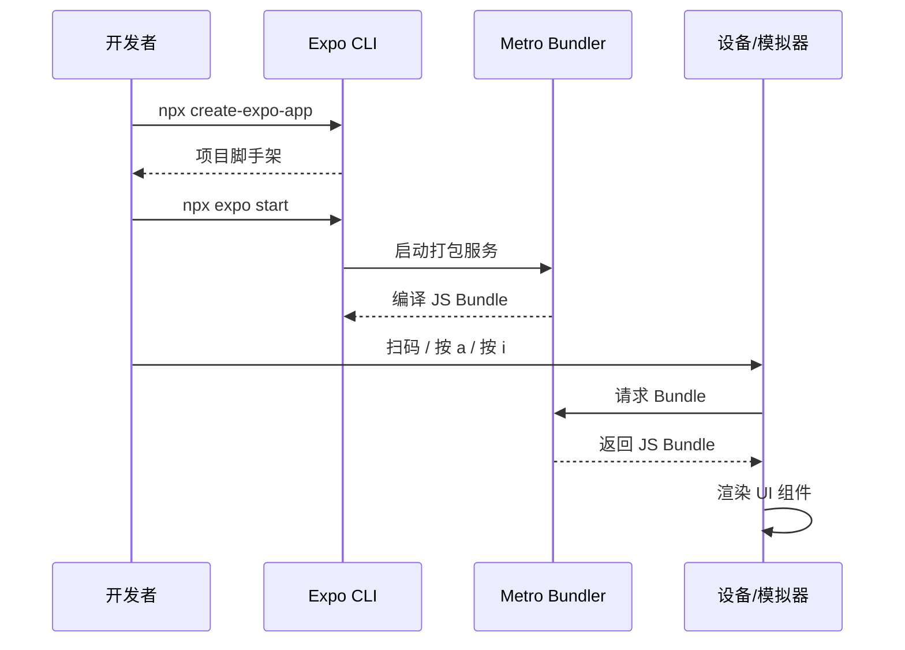
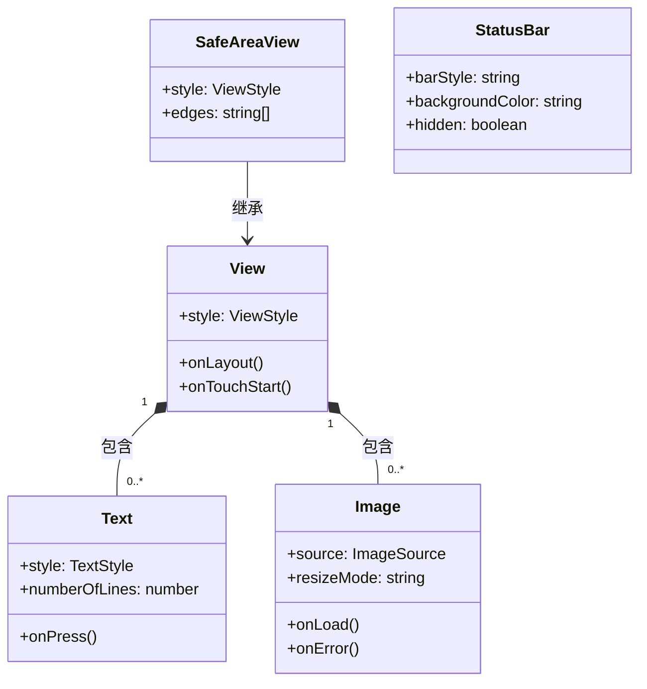

# 01 Expo 环境搭建与核心组件

## 背景说明

Expo 是基于 React Native 的跨平台应用开发框架，提供从开发、构建到发布的一站式工具链。相比于裸 React Native，Expo 屏蔽了原生配置细节，内置了打包、OTA 更新、权限管理等能力，让开发者专注于业务逻辑。

## 核心概念与 API

| 概念 | 说明 |
|------|------|
| **Expo Router** | 基于文件系统的路由方案，类似 Next.js，`app/` 目录下的文件自动映射为页面路由 |
| **View** | 最基础的布局容器，相当于 HTML 的 `div`，支持 Flexbox 布局 |
| **Text** | 文字渲染组件，所有文本必须包裹在 Text 中 |
| **Image** | 图片加载组件，支持网络图、本地图、静态资源导入 |
| **SafeAreaView** | 安全区域适配组件，自动避开刘海屏、底部虚拟按键区域 |
| **StatusBar** | 状态栏控制组件，可设置背景色、文字颜色 |

## 代码说明

App.tsx 使用 `SafeAreaView` + `StatusBar` 构建安全区域容器，内部通过 `View`（卡片容器）、`Image`（远程图片加载）、`Text`（标题/副标题/正文）三个核心组件演示 Expo 基础 UI 搭建。整体布局采用 Flexbox 居中，卡片带圆角(`borderRadius: 16`)、阴影(`shadowColor`/`elevation`)增强视觉层级。

## 常见报错

| 错误 | 原因与解决 |
|------|-----------|
| `Unable to resolve module` | 依赖未安装，运行 `npx expo install <package>` |
| `Image source "uri" is required` | Image 的 source 必须传对象 `{ uri: '...' }` 或 `require(...)` |
| `Text strings must be rendered within a <Text> component` | 在 View 中直接写字符串，必须用 Text 包裹 |
| `export default function App()` 不显示 | 确保文件是 `app/index.tsx` 或根目录 `App.tsx` |

## Mermaid 时序图

## Mermaid 类图

问题解惑

| 问题                                                 | 解答                                                                                                                                                                                                                                                                                                                   |
| ------------------------------------------------------ | ------------------------------------------------------------------------------------------------------------------------------------------------------------------------------------------------------------------------------------------------------------------------------------------------------------------------ |
| **JS Bundle 是什么？**                               | JS Bundle 是 Metro Bundler 将项目的所有 JavaScript/TypeScript 代码、依赖库打包成的单一文件。在 Expo 中，`npx expo start` 启动 Metro 后，设备/模拟器通过 HTTP 请求获取这个 Bundle，由 JavaScript 引擎（Hermes 或 JSC）解析执行。类似 Web 开发中 Webpack/Vite 打包出的 `bundle.js`，区别在于它运行在移动端的 JS 引擎上。 |
| **`export default function App()` 为什么不走路由？** | 根目录的`App.tsx` 是 Expo 传统入口。如果项目没有 `app/` 目录且 `app.json` 未启用 `expo-router`，Expo 直接渲染 `App.tsx` 导出的组件，不走文件路由。                                                                                                                                                                     |
| **View 和 div 有什么本质区别？**                     | View 对应原生平台的`UIView`(iOS) 或 `ViewGroup`(Android)，并非浏览器 DOM 元素。它不支持 HTML 内联样式、不支持 Web 事件冒泡，所有样式通过 StyleSheet 或内联对象传递，最终映射为原生 View 的属性。                                                                                                                       |
| **为什么文字必须放在 Text 中？**                     | React Native 的渲染引擎只允许 Text 组件创建原生文字节点（iOS 的`RCTText` / Android 的 `ReactTextView`）。直接在其他组件中写字符串会导致 `Text strings must be rendered within a <Text> component` 报错。                                                                                                               |
