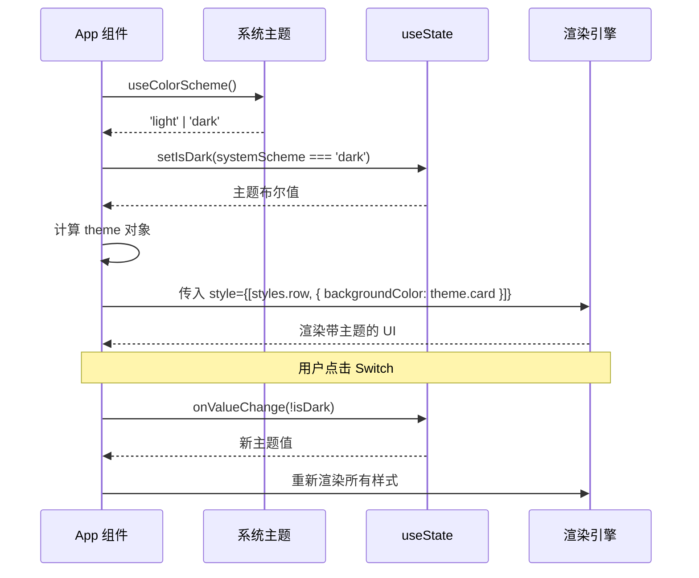
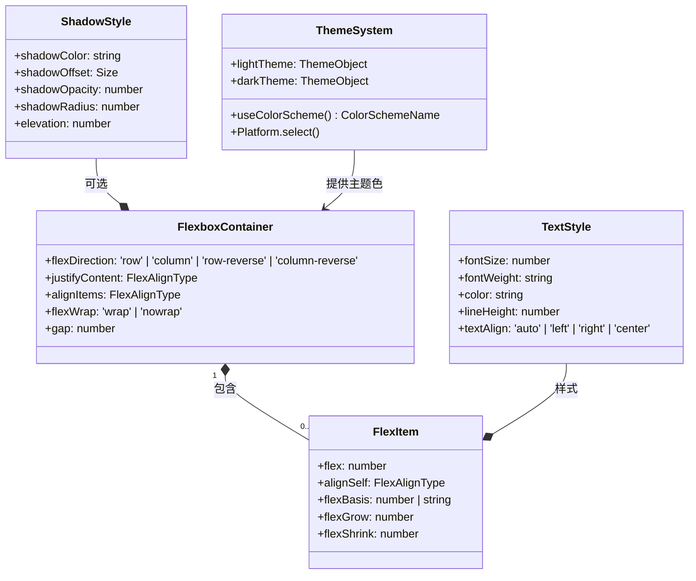

# 02 Flexbox 弹性盒布局与样式美化

## 背景说明

Flexbox（弹性盒子） 是 CSS 一维布局模型，专为行 / 列方向的元素排列、对齐、空间分配设计，替代传统浮动布局，适配性更强。

React Native 使用 Flexbox 作为布局模型，与 CSS Flexbox 基本一致但存在差异（默认 `flexDirection: 'column'`）。跨平台适配需要关注 iOS 与 Android 在阴影、圆角、滚动等方面的差异。暗黑模式通过 `useColorScheme()` 读取系统主题实现。

## 核心概念与 API

| 属性                    | 取值                                                                    |
| ------------------------- | ------------------------------------------------------------------------- |
| **flexDirection**       | 主轴方向，RN 默认为`'column'`（Web 默认 `'row'`）                       |
| **justifyContent**      | 主轴对齐方式：flex-start, center, flex-end, space-between, space-around |
| **alignItems**          | 交叉轴对齐方式：stretch, center, flex-start, flex-end                   |
| **flexWrap**            | 是否换行：nowrap, wrap                                                  |
| **flex**                | 弹性比例，正数表示占据剩余空间的权重                                    |
| **useColorScheme()**    | 返回系统颜色方案`'light'` 或 `'dark'`                                   |
| **StyleSheet.create()** | 创建样式对象，提供类型安全和性能优化                                    |
| **Platform.select()**   | 根据平台返回不同值                                                      |

## 跨平台适配要点

| 特性   | iOS                                 | Android                   |
| -------- | ------------------------------------- | --------------------------- |
| 阴影   | `shadowColor/Offset/Opacity/Radius` | `elevation`               |
| 圆角   | `borderRadius` 一致                 | `borderRadius` 一致       |
| 状态栏 | `SafeAreaView` 适配                 | `StatusBar.currentHeight` |

## 代码说明

App.tsx 演示了 Flexbox 四大核心布局模式：`justifyContent: space-around`（主轴等距分布）、`alignItems: center`（交叉轴居中 + 子元素不同高度）、`flexWrap: wrap`（换行排列）、`flex` 比例（1:2:1 宽度分配）。同时集成 `useColorScheme` 检测系统主题，通过 `Switch` 组件手动切换暗黑/明亮模式，所有颜色值动态切换。

## 常见报错

| 错误                                             | 原因与解决                                                                    |
| -------------------------------------------------- | ------------------------------------------------------------------------------- |
| `StyleSheet: `%s` is not a valid style property` | 属性名拼写错误，注意 camelCase（如`backgroundColor` 而非 `background-color`） |
| 暗黑模式不生效                                   | 模拟器/设备系统主题未切换，或未重新挂载组件                                   |
| 阴影只在 Android 不显示                          | Android 使用`elevation`，iOS 使用 `shadow*` 系列属性                          |

## Mermaid 时序图

## Mermaid 类图

