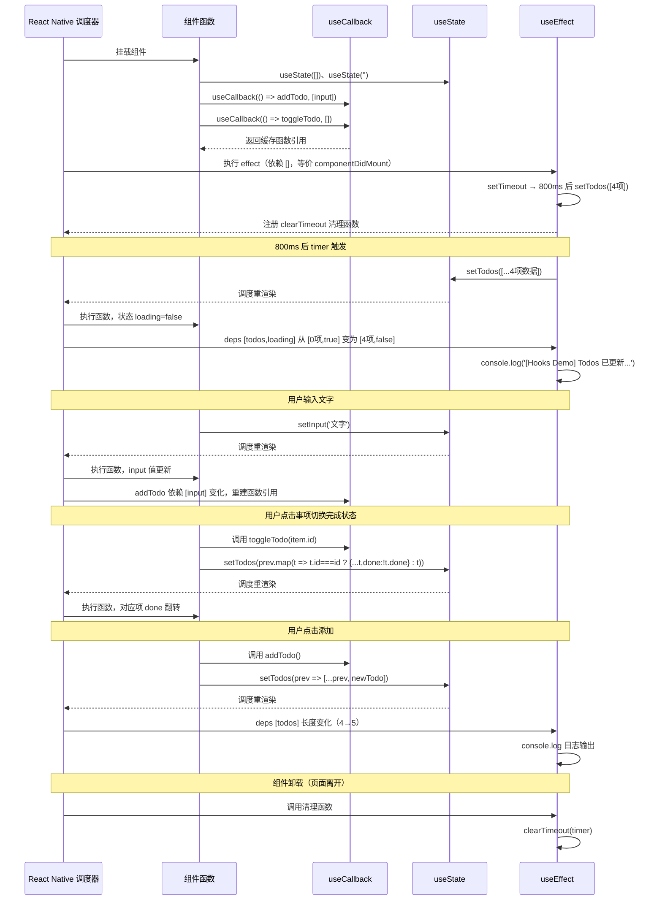
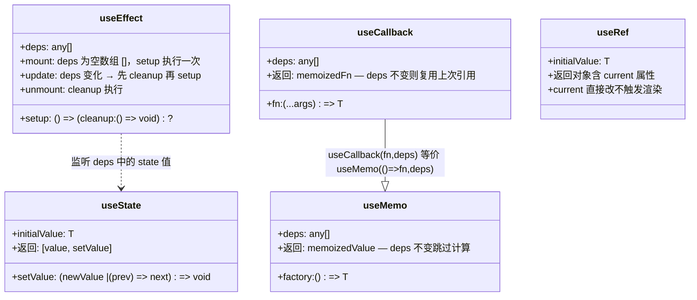

# 03 React Hooks 在移动端的实践

## 背景说明

React Hooks（useState、useEffect、useCallback 等）在 React Native 中与 Web 端使用方式基本相同，但需注意移动端特有的生命周期差异。例如：App 前后台切换、键盘弹出、导航焦点变化等场景下，useEffect 的行为需要特殊处理。

## 核心概念与 API

| Hook | 说明 |
|------|------|
| **useState** | 状态管理，返回 `[value, setValue]`，setter 支持函数式更新 |
| **useEffect** | 副作用处理，依赖数组控制执行时机；空数组 `[]` 模拟 mount，return 函数模拟 unmount |
| **useCallback** | 缓存函数引用，避免子组件不必要重渲染，依赖数组变化时重建 |
| **useMemo** | 缓存计算结果，依赖未变时跳过计算 |
| **useRef** | 保持可变引用，变更不触发渲染；常用于获取组件实例 |
| **useColorScheme** | Expo 提供的系统主题监听 Hook |

## 移动端 vs Web 的 useEffect 差异

| 场景 | Web | React Native |
|------|-----|-------------|
| 组件挂载 | `[]` 执行一次 | 同上，但注意 `AppState` 变化 |
| 键盘弹出 | 不需要 | 使用 `Keyboard.addListener`，useEffect 中注册/清理 |
| 导航焦点 | 不需要 | 使用 `useFocusEffect`（React Navigation） |
| 前后台切换 | 不需要 | 使用 `AppState.addEventListener('change', ...)` |

## 代码说明

App.tsx 实现了一个 Todo 应用来演示核心 Hooks：`useState` 管理待办列表和输入框状态；`useEffect` 模拟异步数据加载（800ms 延迟后填充初始数据），并通过依赖数组 `[todos]` 监听数据变化；`useCallback` 包裹 `addTodo`/`toggleTodo` 保持引用稳定。列表项点击切换完成状态，带删除线样式反馈。

## 常见报错

| 错误 | 原因与解决 |
|------|-----------|
| `Warning: Can't perform a React state update on an unmounted component` | useEffect 返回清理函数取消异步操作 |
| `useState` 更新不触发渲染 | 直接修改对象/数组未创建新引用，用扩展运算符创建新副本 |
| `useEffect` 死循环 | 依赖数组未正确设置，漏填或填入了每次变化的值 |
| `useCallback` 闭包陷阱 | 回调中使用了过时的 state，在依赖数组中包含相关变量 |

## Mermaid 时序图

## Mermaid 类图

